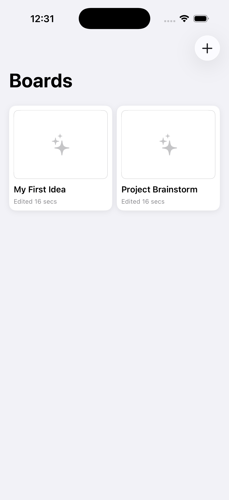
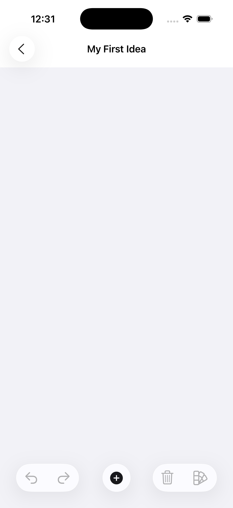
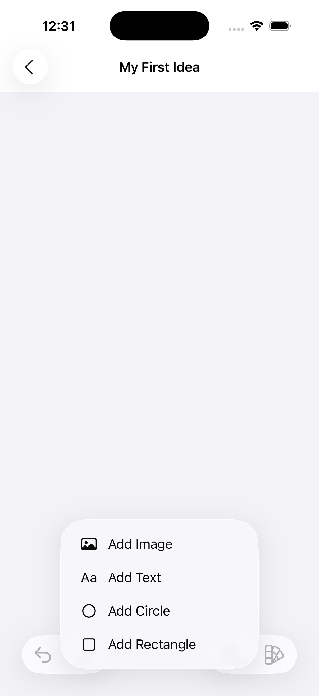
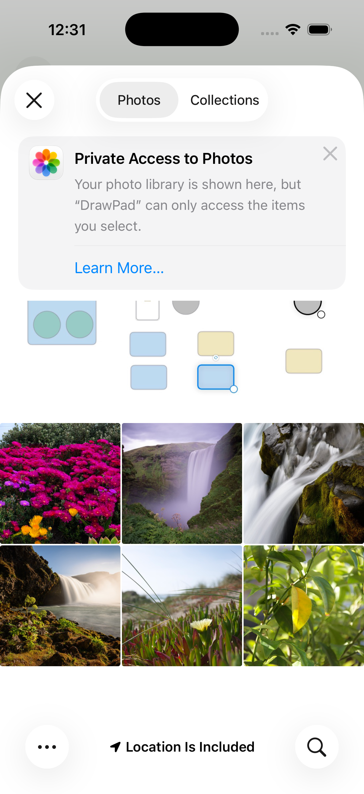

# DrawPad

A lightweight and intuitive digital whiteboarding application for iOS and iPadOS, built entirely with SwiftUI. Inspired by the Freeform app on Apple platforms, DrawPad provides a freeform canvas where you can add shapes, text, and images to bring your ideas to life.

## Features

- **Object-Oriented Canvas:** Add, select, and manage various objects on the board.
- **Rich Object Types:**
    - **Shapes:** Add rectangles and circles with customizable colors.
    - **Text:** Add and edit text directly on the canvas with a double-tap.
    - **Images:** Import images from your photo library using the modern `PhotosPicker`.
- **Intuitive Gestures:**
    - **Drag & Drop:** Easily move objects around the canvas.
    - **Resize:** Resize any object from its corners with visual handles.
- **Robust Undo/Redo:** A complete history stack allows you to step backward and forward through your changes.
- **Board Gallery:** Create and manage multiple boards in a clean, scrollable grid view.
- **Modern UI:** Built with SwiftUI for a responsive and fluid user experience that works great on both iOS and iPadOS.

## Screenshots

Here's a glimpse of DigitalDrawPad in action.

| Board Gallery | Drawing Canvas |
|:---:|:---:|
|  |  |

| Text Editing | Image Importing |
|:---:|:---:|
|  |  |

## Technology Stack

- **Framework:** SwiftUI
- **Language:** Swift
- **Concurrency:** Swift Concurrency (`async`/`await`) is used for non-blocking image loading from the photo library.
- **Photo Library:** `PhotosUI` provides a modern, private-by-default image picking experience.
- **Architecture:** The app follows an MVVM-inspired architecture where `Board` serves as an `ObservableObject` view model for the main `BoardView`.

## Architectural Highlights

- **Declarative UI:** The entire user interface is built declaratively with SwiftUI, leading to more readable and maintainable code.
- **Data Flow:** SwiftUI's property wrappers (`@State`, `@ObservedObject`, `@FocusState`) are used to manage state and drive UI updates automatically.
- **Component-Based Views:** The UI is broken down into small, reusable components like `BoardThumbnailView` and `CanvasItemView`, promoting modularity.
- **Custom Gestures:** The app implements custom `DragGesture` logic to handle the complex interactions of moving and resizing objects on the canvas.

## Future Improvements

- **Data Persistence:** Implement saving and loading of boards using SwiftData or Core Data.
- **Advanced Styling:** Expand the inspector to allow changing border colors, border widths, fonts, and opacity.
- **Rotation & Z-Index:** Add gestures for rotating objects and controls for changing their layer order (bring to front/send to back).
- **Export:** Allow users to export their boards as PNG or PDF files.
- **More Object Types:** Introduce new objects like arrows, lines, and freeform pencil drawing.

## How to Run

1. Clone the repository.
2. Open `DrawPad.xcodeproj` in Xcode.
3. Select a simulator or a physical device.
4. Build and run the project (Cmd+R).
